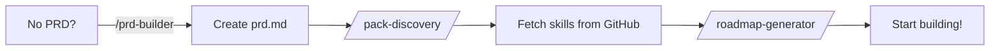

# Antigravity Skills Boilerplate

**Agentic AI Workflow Starter Kit**

Clone this repo to start any project with built-in AI agent support. Skills are fetched automatically from GitHub—no local setup required.

---

## Quick Start

### 1. Clone for New Project

```bash
git clone https://github.com/AccurateTLM13/antigravity-skills-boilerplate.git my-project
cd my-project
rm -rf .git && git init  # Fresh history
```

### 2. Start the Workflow

Open your AI agent and say:

> **"Let's begin with Phase 0: Pack Discovery"**

Or use the slash command: **`/pack-discovery`**

---

## What Happens Next



1. **PRD Check** – If no `prd.md` exists, the agent interviews you to create one
2. **Pack Discovery** – Skills are fetched from [rmyndharis/antigravity-skills](https://github.com/rmyndharis/antigravity-skills) and matched to your project
3. **Roadmap** – A phased project plan is generated from your PRD
4. **Implementation** – Work through each phase with full skill context

---

## Workflows

| Command | Description |
|---------|-------------|
| `/pack-discovery` | Fetch skills from GitHub, match to PRD |
| `/prd-builder` | Interview to create Product Requirements |
| `/roadmap-generator` | Generate phased project plan |
| `/skill-preview` | Vet custom skills before activation |

---

## Repository Structure

```
.agent/
├── instructions.md      # Core protocol
├── project-context.md   # Living project state
├── project-state.json   # Skill tracking
├── skills/              # Downloaded skills go here
│   ├── architecture.md
│   └── adr.md
└── workflows/
    ├── pack-discovery.md
    ├── prd-builder.md
    ├── roadmap-generator.md
    └── skill-preview.md
.clinerules              # Agent behavior rules
```

---

## Custom Skills

Want to use skills from other repos?

1. Run `/skill-preview [url]` to vet the skill
2. Agent performs security checks
3. You approve or reject
4. Approved skills are added to your project

---

## Core Skills (Pre-installed)

Every project includes these mandatory skills:
- **C4 Architecture** – System context and container diagrams
- **ADR** – Architecture Decision Records

---

## Skills Repository

Skills are sourced from: [github.com/rmyndharis/antigravity-skills](https://github.com/rmyndharis/antigravity-skills)

- 300+ skills covering frameworks, patterns, and domains
- Bundles for common project types
- Always fetches latest from main branch
